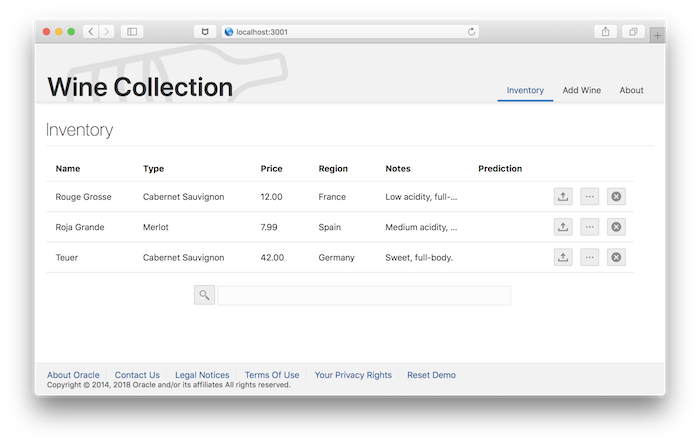

# Introduction

This example Node.js application manages a wine collection.  The
application uses simple CRUD (create, read, update, and delete)
operations over a collection of JSON documents stored in Oracle
Database (see [db/wines-oracle.js](db/wines-oracle.js)).  The application code does not use SQL but
SQL can still be used over the data for reporting and analytics when
needed (see [sql/examples.sql](sql/examples.sql)).  This development model gives the
flexibility and ease-of-use common to NoSQL document stores without
losing the ability to leverage SQL directly over operational data.

# References

* SODA API  
  [https://docs.oracle.com/en/database/oracle/simple-oracle-document-access/nodejs/index.html]()

* SQL/JSON  
  [https://docs.oracle.com/en/database/oracle/oracle-database/19/adjsn/index.html]()

# Installation

* Get Node.js.  For example:
  ~~~~
  wget "https://nodejs.org/dist/v10.16.3/node-v10.16.3-linux-x64.tar.xz"
  tar -xvf node-v10.16.3-linux-x64.tar.xz
  setenv PATH "/scratch/local/jsondb/node-v10.16.3-linux-x64/bin:$PATH"
  ~~~~

* Install JET  
  ~~~~
  npm -g install @oracle/ojet-cli`
  ~~~~

* From the `WineDemo` directory, run
  ~~~~
  npm install
  ~~~~

* Add client libraries to `LD_LIBRARY_PATH`.  See:  
  [https://github.com/oracle/node-oracledb/blob/master/INSTALL.md]()

* Set database connection information

  ~~~~
  export NODE_ORACLEDB_USER=scott
  export NODE_ORACLEDB_PASSWORD=tiger
  export NODE_ORACLEDB_CONNECTIONSTRING=localhost:8012/rdbms.regress.rdbms.dev.us.oracle.com
  ~~~~

* Build JET 
  ~~~~
  ojet build
  ~~~~

* Start node.js

  ~~~~
  node server.js
  ~~~~

* Open demo app  
  [http://localhost:3001]()
